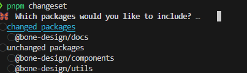
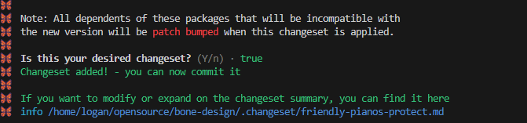

learning how to develop components 

## 📦 Installation

## ✨ Features

- 方便扩展样式
- 无头组件驱动, 功能丰富
- 组件模板 , 复制粘贴 即可复刻
- 集合组件开发常见的需求, 做到开箱即用
- 基于 shadcn/ui 开发 

## 🖥 Browser compatibility


## ⌨️ Local Development


## 🛣️ Ecosystem


#### 📝 License


## 🤝 Contributing

使用 changeset 管理版本

```bash
pnpm changeset
```




完成后会在 .changeset文件夹 生成 临时文件,  可以多次执行命令, 然后发版前一次消耗完所有的临时文件, 如下

```bash
pnpm changeset version
pnpm changeset publish -r
```


### 需求记录

1. 数字金额输入框

正数, 无负数, 避免小数点(保留有效数字), 千分位展示


2. 枚举值

异步的搜索
表格枚举值的展示
多个组件 接口 batch 请求

3. 百分比字符串 转换数字

`parseInt` 和 `parseFloat` 
js 在语言层面没有区分浮点数 和 整数 不像 java
https://developer.mozilla.org/en-US/docs/Web/JavaScript/Reference/Global_Objects/parseFloat

```javascript
const string = "0.00%"
const string1 = "0.1"
const string2 = "1"
const string3 = "好"

console.log(parseFloat(string), Boolean(parseFloat(string)))
console.log(parseFloat(string1), Boolean(parseFloat(string1)))
console.log(parseFloat(string2), Boolean(parseFloat(string2)))
console.log(parseFloat(string3), Boolean(parseFloat(string3)))

```

4. 防止隐式类型转换

特别注意  数字 0  字符串 0 在 三元表达式下  的 隐式类型转换 false 的 情况


5. Utils 库搭建,  参考lodash Radash
   以及添加自己认为的好用的方法
   
6. RTL 支持
   - 参考资料
   - https://github.com/happylindz/blog/issues/16
   - https://www.mdui.org/design/usability/bidirectionality.html#
   - https://developer.android.com/training/basics/supporting-devices/languages?hl=zh-cn
   - https://developers.google.com/fonts/docs/material_icons?hl=zh-cn


